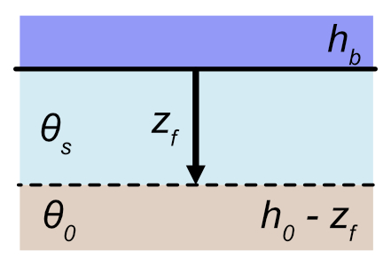
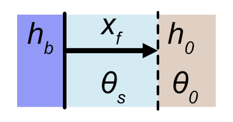
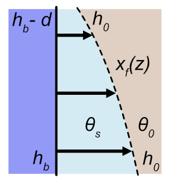
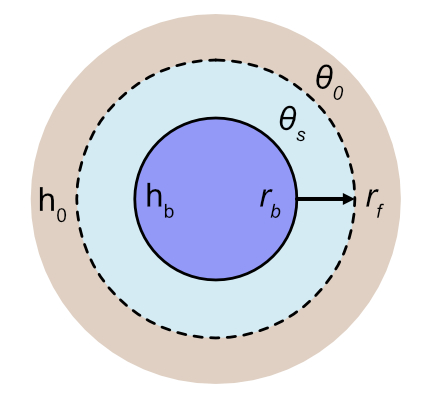
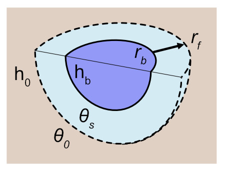

```{r, include = FALSE}
knitr::opts_chunk$set(
  collapse = TRUE,
  comment = "#>"
)
```

```{r setup}
library(rechargepits)
```

# Recharge model derivations

This packages provides analytical and root-finding methods for calculating groundwater recharge under specific geometries. In each case, the models follow assumptions used in the Green-Ampt method:

1. Homogeneous soil with initial water content (theta_0)
2. Constant pressure head (h_0) at the wetting front
3. Saturated soil above above wetting front
4. Continuous supply of water with constant head (h_b) at the soil surface boundary

The building blocks of the pit recharge calculations are analytical equations simulating the specific infiltration scenarios described below. 

## Vertical flow: Green-Ampt equation

```{r, out.width = "200px", echo = FALSE}

```

To derive the Green-Ampt equation, we need to combine the following equations. First, Darcy flow:

$$
q = -K_{sat} \frac{\partial h}{\partial z}
$$
Where $q$ is the downward Darcy point flow, $h$ is hydraulic head as the sum of pressure and elevation head, $K_{sat}$ is saturated hydraulic conductivity, and $z$ is elevation (positive is downward). Note that the total head at the bottom of the pit ($z=0$) is $h_b$ and at the wetting front ($z=z_f$) is $h_0 - z_f$. Due to the linear relationship between $h$ and $z$, integrating this equation allows us to calculate $q$ as:

$$
q = K_{sat} \frac{h_b - (h_0 - z_f)}{z_f}
$$

We also know that the downward propagation of the wetting front occurs at the rate 

$$\frac{\partial z_f}{\partial t} = \frac{q}{\Delta \theta},$$ 

where $\Delta \theta = \theta_s - \theta_0$. We further know that the cumulative infiltration is $F = z_f \Delta \theta$, and combining the above equations with this substitution yields:

$$
\frac{F}{\Delta \theta} \frac{\partial F}{\partial t} = K_{sat} (h_b + F/\Delta \theta - h_0)
$$


Integration of the above equation yields the Green-Ampt equation, with time $t$ as a function of cumulative 1-D infiltration $F$:

$$
t = \frac{1}{K_{sat}}\Big[F - \Delta \theta (h_b - h_0) \ln (1 + \frac{F}{\Delta \theta (h_b - h_0)}) \Big]
$$

The Green-Ampt equation is implemented in this package through the function `get_greenampt_time` which implements the analytical version, as well as the function `get_greenampt_flow_numerical` which uses a root solver to find cumulative infiltration as a function of time. Note that the package functions expects `units` objects where appropriate to ensure proper arithmetic with dimensional variables. Below, the numerical approximation calculates $F$ at $t \in [0, 2, 5, 10, 20, 40, 60]$ minutes.

```{r}
# prep soil variables
library(rechargepits)
library(units)
theta_0 <- 0.2 # unitless
theta_s <- 0.35 # unitless
Ksat <- set_units(0.2, "cm/h") # length / time
h_b <- set_units(6, "ft") # hydraulic head (length)
h_0 <- set_units(-10, "cm") # hydraulic head (length)
times <- set_units(c(0, 2, 5, 10, 20, 40, 60), "min")

# Calculate cumulative infiltration as a function of time
Fcum <- get_greenampt_flow_numerical(theta_0, theta_s, Ksat, h_b, h_0, times)
Fcum
```
Note that the returned vector is a `units` object, in this case with units of mm. We can make sure the two functions produce the same results by using the analytical version to convert back to time as follows, and plot the results.

```{r fig.width = 6}
# Calculate time as a function of Fcum 
time_calc <- set_units(get_greenampt_time(theta_0, theta_s, Fcum, Ksat, h_b, h_0),"min")

df <- data.frame(time = c(times, time_calc),
                 Fcum = rep(Fcum, 2),
                 group = rep(c("Fcum = f(t)", "t = f(Fcum)"), each = length(Fcum)))
library(ggplot2)
ggplot(df) + 
  geom_point(aes(time, Fcum, color = group, shape = group), size = 3, stroke = 1) +
  scale_shape_manual(values = c(1, 3))
```

## Horizontal flow: Green-Ampt without gravity

### Horizontal parallel flow

```{r, out.width = "150px", echo = FALSE}

```

This scenario is similar to Green-Ampt except that the flow occurs horizontally through a vertical surface. Darcy flow in this case can be calculated as:
$$
q = K_{sat} \frac{h_b - h_0}{x_f},
$$
where the only new variable is $x_f$, the horizontal distance from the soil boundary to the wetting front. Note that cumulative infiltration is $F = x_f \Delta \theta$. Also note that $x_f$ is not present in the numerator. This equation becomes:

$$
\frac{F}{\Delta \theta} \frac{\partial F}{\partial t} = K_{sat} (h_b - h_0).
$$

Once integrated, we get two versions of the final equations, one solved for $t$:
$$
t = \frac{F^2}{2 \Delta \theta K_{sat} (h_b - h_0)}
$$
and the other for $F$:
$$
F = \sqrt{2 \Delta \theta K_{sat} (h_b - h_0) t},
$$

Using the same soil properties as above, we can calculate infiltration using `get_greenampt_horiz_flow` and `get_greenampt_horiz_time`:

```{r}
# Calculate cumulative infiltration as a function of time
Fcum_horiz <- get_greenampt_horiz_flow(theta_0, theta_s, Ksat, h_b, h_0, times)
Fcum_horiz
```

```{r fig.width = 6}
time_calc <- set_units(get_greenampt_horiz_time(theta_0, theta_s, Fcum_horiz, Ksat, h_b, h_0),"min")

df <- data.frame(time = c(times, time_calc),
                 Fcum = rep(Fcum, 2),
                 group = rep(c("Fcum = f(t)", "t = f(Fcum)"), each = length(Fcum)))
library(ggplot2)
ggplot(df) + 
  geom_point(aes(time, Fcum, color = group, shape = group), size = 3, stroke = 1) +
  scale_shape_manual(values = c(1, 3))

```

### Horizontal parallel flow integrated over a depth

```{r, out.width = "150px", echo = FALSE}

```

Now we'd like to have a single equation to calculate the horizontal infiltration over a vertical surface, which we refer to as $F_v$, while noting that $\Delta F_v = F \Delta z$. Therefore we need to integrate, noting that we now use $h_p(z)$ to indicate the pressure head in the pit:

$$
F_v = \int F \partial z = \sqrt{2 \Delta \theta K_{sat} t} \int_{z_1}^{z_1 + d} (h_p(z) - h_0)^{1/2} \partial z
$$

where $d$ is the depth of the profile over which to integrate (e.g., the bottom of the pit). If we define $z$ as being positive in the downward direction then $h_p = z$. We define $h_b$ as the pressure head at the bottom of the profile, which entails that $z_2 = h_b$ and $z_1 = h_b - d$ at the top of the pit. The integration becomes:

$$
F_v = \sqrt{2 \Delta \theta K_{sat} t} \int_{h_b - d}^{h_b} (z - h_0)^{1/2} \partial z 
$$
Integrating the right side we end up with:
$$
F_v = \sqrt{\frac{8}{9} \Delta \theta K_{sat} t} \Big[(h_b - h_0)^{3/2} - (h_b - d - h_0)^{3/2} \Big]
$$

This equation is implemented with `get_greenampt_horiz_flow_integrated`. 

```{r}
library(units)
theta_0 <- 0.2 # unitless
theta_s <- 0.35 # unitless
Ksat <- set_units(0.2, "cm/h") # length / time
h_b <- set_units(6, "ft") # hydraulic head (length)
h_0 <- set_units(-10, "cm") # hydraulic head (length)

Fv <- get_greenampt_horiz_flow_integrated(theta_0, theta_s, Ksat, h_b, h_0, times = set_units(1,"hr"), d = NULL)
```

To demonstrate this works, we can compare the point flow with the integrated flow over a differential depth (e.g., 1 mm):

```{r}
# Get the infiltration over a 1 mm differential depth to compare with the point infiltration
Fv_dv <- get_greenampt_horiz_flow_integrated(theta_0, theta_s, Ksat, h_b, h_0, times = set_units(1,"hr"), d = set_units(1, "mm"))
Fv_point <- Fv_dv/ set_units(1, "mm")
Fv_point

# Get the point infiltration
F_point <- get_greenampt_horiz_flow(theta_0, theta_s, Ksat, h_b, h_0, times = set_units(1,"hr")) 
F_point <- set_units(F_point, "mm")
F_point
# percent error: (Fv_point - F_point) / F_point * 100
```

The percent error is `r round((Fv_point - F_point) / F_point * 100, 3)`\%. 

This final example shows how the shape of the wetting front along the profile is curved.

```{r, fig.width = 6, fig.height = 4}
VWC_0 <- 0.2 # unitless
n <- 0.35 # unitless
Ksat <- set_units(0.2, "cm/h") # length / time
h_b <- set_units(seq(0,6), "ft") # hydraulic head (length)
h_0 <- set_units(-10, "cm") # hydraulic head (length)
times <- set_units(c(60), "min")

# Calculate cumulative infiltration as a function of time

for (i in 1:length(h_b)) {
  h_b_z <- h_b[i]
  if (i == 0) {
    Fcum[i] <- get_greenampt_flow_numerical(VWC_0, n, Ksat, h_b_z, h_0, times)
  } else {
    Fcum[i] <- get_greenampt_flow_numerical(VWC_0, n, Ksat, h_b_z, h_0, times)
 
  }
}

plot(Fcum, -h_b)
```


### Horizontal flow through a cylinder

```{r, out.width = "200px", echo = FALSE}

```

We now focus on horizontal flow (i.e., no gravity effect) radially outward through cylinder. In this case the goal is to calculate the radius of the wetting front ($r_f$), from which the cumulative infiltration can be calculated at any time $t$ as $F_c = \pi (r_f^2 - r_b^2) \Delta \theta$, where $r_b$ is the boundary of the recharge pit.

We note that $Q = 2 \pi r q(r)$ and therefore $q = \frac{Q}{2 \pi r}$. Because $q$ is the Darcy flow, we can plug this into Darcy's law to obtain:
$$
\frac{Q}{2 \pi r} = -K_{sat} \frac{\partial h}{\partial r}
$$
Integrating this equation from $(r_b, h_b)$ to $(r_f, h_0)$, we get:
$$
Q = 2 \pi K_{sat} (h_b - h_0) \frac{1}{\ln (r_f / r_b)}
$$

We further note that the propagation of the wetting front outward is directly related to $Q$ as $\frac{\partial r_f}{\partial t} = \frac{Q}{2 \pi r_f \Delta \theta}$. Plugging in the equation for $Q$ and rearranging, we obtain:
$$
r_f \ln(r_f / r_b) \partial r_f = \frac{1}{\Delta \theta }(h_b - h_0) \partial t
$$
Integrating the two sides from $(t = 0, r = r_b)$ to $(t, r_f)$, we obtain (via wolfram alpha):
$$
\frac{1}{4} (r_b^2 + 2 r_f^2 \ln \frac{r_f}{r_b} - r_f^2) = t\frac{h_b - h_0}{\Delta \theta }
$$
Finally, solving for $t$, we obtain:
$$
t = \frac{\Delta \theta}{4 (h_b - h_0)} (r_b^2 + 2 r_f^2 \ln \frac{r_f}{r_b} - r_f^2)
$$
$$
t = \frac{\Delta \theta}{4 (h_b - h_0)} \Big[r_b^2 + r_f^2 (2  \ln \frac{r_f}{r_b} - 1) \Big]
$$
As noted above, it is straightforward to convert between $F_c$ and $r_f$. Rearranging the prior equation, we have:
$$
r_f = \sqrt{ \frac{F_c}{\pi \Delta \theta} + r_b^2}
$$

This model is implemented using the functions `get_greenampt_cyl_horiz_time` to calculate time as $t = f(F_c)$ and `get_greenampt_cyl_horiz_numerical` to calculate cumulative recharge $F_c = f(t)$ using a numerical solver.


```{r, fig.width = 6, fig.height = 4}
library(units)
r_b <- set_units(2, "ft") # length
theta_0 <- 0.2 # unitless
theta_s <- 0.35 # unitless
F_c <- set_units(c(1, 5, 10, 20), "ft^2") # units of length^2
Ksat <- set_units(0.2, "cm/h") # length / time
h_b <- set_units(6, "ft") # hydraulic head (length)
h_0 <- set_units(-10, "cm") # hydraulic head (length)
times <- get_greenampt_cyl_horiz_time(theta_0, theta_s, F_c, Ksat, h_b, h_0, r_b)
F_c_calculated <- get_greenampt_cyl_horiz_numerical(theta_0, theta_s, Ksat, h_b, h_0, r_b, times, F_units = "ft^2")


plot(times, F_c, cex = 2, col = 'blue')
points(times, F_c_calculated, pch = 4, col = 'red', cex = 1)
legend(6, 7, legend = c("get_greenampt_hsphere_time", "get_greenampt_hsphere_numerical"), 
       col = c("blue", "red"), cex = 0.8, pch = c(1, 4))
```


## Half-spherical flow without gravity

```{r, out.width = "200px", echo = FALSE}

```

In this case we consider flow through a half spherical surface considering only pressure potentials and ignoring gravity. This model could potentially approximate 3-D infiltration through the bottom of a recharge pit in which the pressure head at the bottom of the pit large enough such that the gravity term is small. The approach to the derivation is similar to cylindrical flow, in that we first need to understand the hydraulic gradient as a function of $r_f$, the radius to the wetting front. The surface area through which flow passes is $2 \pi r^2$, which is half the surface area of a sphere ($4 \pi r^2$). Because only pressure matters and flow is the same throughout the half-sphere, we can write Darcy's law as:
$$
\frac{Q}{2 \pi r^2} = -K_{sat} \frac{\partial h}{\partial r}.
$$

We approximate the bottom of the pit as a half sphere with radius $r_b$, the effective radius of the pit. Although a simplification of reality, it makes the scenario mathematically tractable. We integrate the above equation from the idealized pit boundary $(r_b, h_b)$ to the wetting front $(r_f, h_0)$ and obtain:
$$
\frac{Q}{2 \pi}\Big(\frac{1}{r_b} - \frac{1}{r_f}\Big) = K_{sat} (h_b - h_0)
$$
Solving for $Q$, we obtain:
$$
Q = 2 \pi K_{sat} \Big(\frac{r_b r_f}{r_f - r_b} \Big) (h_b - h_0)
$$

Now that we have $Q$ as a function of $r_f$, we can focus on determining how $r_f$ changes over time. The propagation of $r_f$ is simply the total outward flow $Q$ divided by the surface area of the half sphere $2 \pi r^2$, divided by the available soil storage $\Delta \theta = \theta_s - \theta_0$. In other words:
$$
\frac{\partial r_f}{\partial t} = \frac{Q}{2 \pi r^2 \Delta \theta} \, .
$$
Plugging in for $Q$ and rearranging terms, we get:
$$
\frac{1}{r_b} \Big[ r_f^2 - r_b r_f \Big] \partial r_f = \frac{K_{sat}}{\Delta \theta} \Big[ h_b - h_0 \Big] \partial t \,.
$$

We can then integrate from $(r_b, 0)$ to $(r_f, t)$ to obtain:
$$
\frac{1}{r_b} \Big( \frac{1}{3} r_f^3 - \frac{r_b}{2} r_f^2 \Big) \Bigg|_{r_b}^{r_f} = \frac{K_{sat}}{\Delta \theta} \Big( h_b - h_0 \Big) t \, \Bigg|_0^t
$$

Plugging in values and solving for $t$, we finally obtain:
$$
t = \frac{\Delta \theta}{K_{sat} (h_b - h_0)}  \Bigg[ \frac{r_f^3}{3 r_b}  - \frac{r_f^2}{2} + \frac{r_b^2}{6} \Bigg]
$$

The volume of a half sphere is equal to $V_s(r) = 2/3 \pi r^3$. Therefore we can determine the amount of infiltration as $F_s = \Delta \theta (V_s(r_f) - V_s(r_b))$, or:
$$
F_s = \Delta \theta \pi \frac{2}{3}\Big( r_f^3 - r_b^3 \Big)
$$
Conversely, we can calculate $r_f$ from $F_s$ as:
$$
r_f = \Big( \frac{3 F_s}{2 \Delta \theta \pi} + r_b^3 \Big)^{1/3}
$$

This model is implemented using the functions `get_greenampt_hsphere_time` to calculate time as $t = f(F_s)$ and `get_greenampt_hsphere_numerical` to calculate cumulative recharge $F_s = f(t)$ using a numerical solver.

```{r, fig.width = 6, fig.height = 4}
library(units)
r_b <- set_units(2, "ft") # length
theta_0 <- 0.2 # unitless
theta_s <- 0.35 # unitless
F_s <- set_units(c(1, 5, 10, 20), "ft^3") # units of length^2
Ksat <- set_units(0.2, "cm/h") # length / time
h_b <- set_units(6, "ft") # hydraulic head (length)
h_0 <- set_units(-10, "cm") # hydraulic head (length)
times <- get_greenampt_hsphere_time(theta_0, theta_s, F_s, Ksat, h_b, h_0, r_b)
F_s_calculated <- get_greenampt_hsphere_numerical(theta_0, theta_s, Ksat, h_b, h_0, r_b, times)

plot(times, F_s, cex = 2, col = 'blue')
points(times, F_s_calculated, pch = 4, col = 'red', cex = 1)
legend(6, 7, legend = c("get_greenampt_hsphere_time", "get_greenampt_hsphere_numerical"), 
       col = c("blue", "red"), cex = 0.8, pch = c(1, 4))
```

